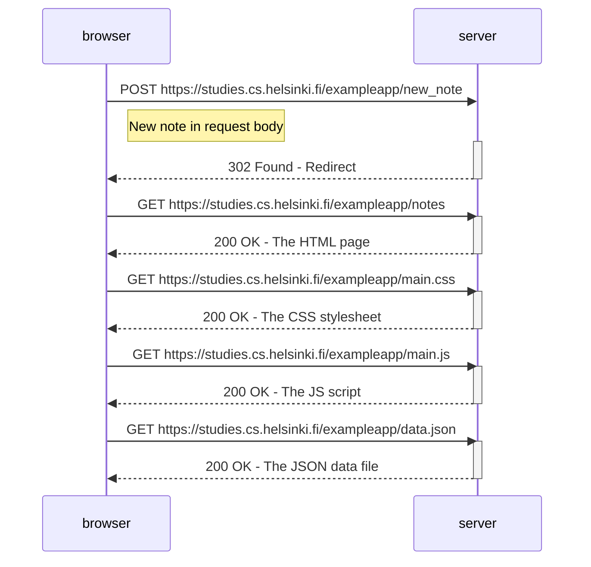

The diagram for exercise 0.4:

```mermaid
sequenceDiagram

participant browser
participant server

browser->>server: POST https://studies.cs.helsinki.fi/exampleapp/new_note
Note right of browser: New note in request body
activate server
server-->>browser: 302 Found - Redirect
deactivate server

browser->>server: GET https://studies.cs.helsinki.fi/exampleapp/notes
activate server
server-->>browser: 200 OK - The HTML page
deactivate server

browser->>server: GET https://studies.cs.helsinki.fi/exampleapp/main.css
activate server
server-->>browser: 200 OK - The CSS stylesheet
deactivate server

browser->>server: GET https://studies.cs.helsinki.fi/exampleapp/main.js
activate server
server-->>browser: 200 OK - The JS script
deactivate server

browser->>server: GET https://studies.cs.helsinki.fi/exampleapp/data.json
activate server
server-->>browser: 200 OK - The JSON data file
deactivate server
```
